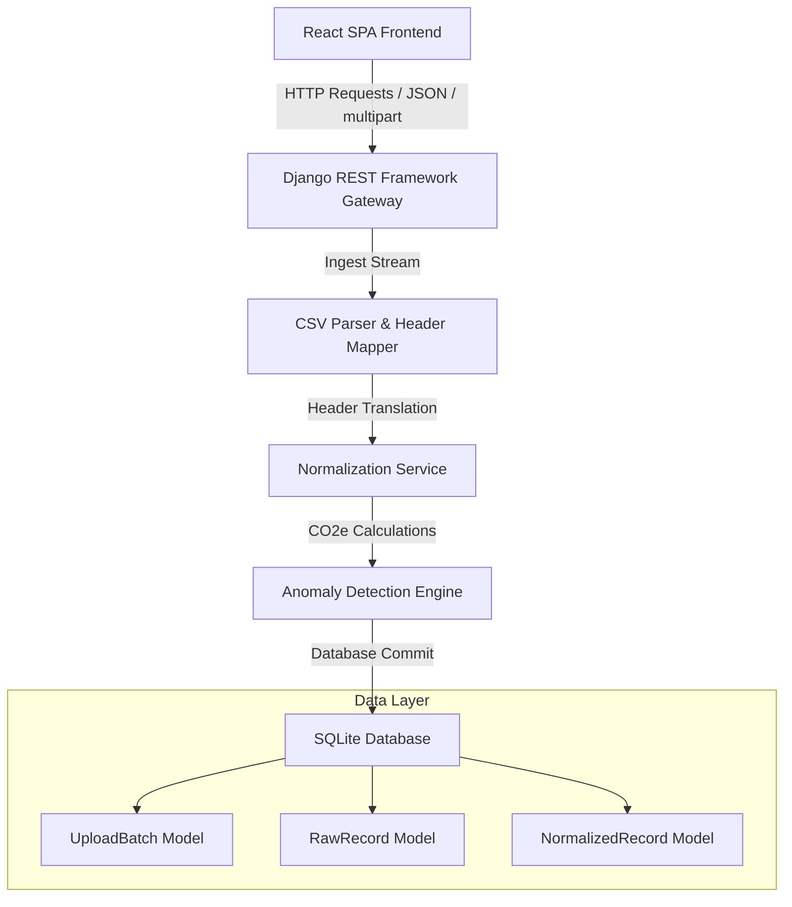

# ESG Platform Architecture and Data Model (MODEL.md)

This document provides a comprehensive technical overview of the system architecture, database models, ingestion pipelines, and audit strategies implemented in the ESG Ingestion and Normalization Platform.

---

## 1. System Architecture

The application is structured as a decoupled, multi-tiered web application designed for auditability and robust data lineage tracing:



### Components
* **Frontend (React 18 SPA)**: A high-fidelity, single-page application styled using a dark glassmorphic design system. It handles CSV file drops, performs real-time queries to filters, visualizes normalized data, and provides analysts with manual validation controls (Approve/Reject).
* **Backend (Django REST Framework & Python 3)**: Serves a lightweight API. It includes custom services for header mapping, parsing flexible datetime schemas, mathematical standardizations, and rules-based anomaly detection.
* **Database (SQLite)**: Configured as the default persistence layer for the local analyst prototype, employing a fully relational structure that can easily be scaled to a production-grade relational database like PostgreSQL.

---

## 2. Database Models and Schema Design

The schema is built around three core models that establish a strict relationship chain from raw uploads to standardized audit files:

```
[UploadBatch]
     │ (1)
     ├───► [RawRecord] (1:1 with NormalizedRecord)
     │         │
     │ (1)     ▼ (1)
     └───► [NormalizedRecord]
```

### 1. `UploadBatch`
Represents an ingestion job triggered by uploading a spreadsheet. It acts as an audit trail for data lineage, keeping record metrics of parsing runs.

* **Fields**:
  * `source_type` (CharField, choices: `SAP`, `Utility`, `Travel`): Gateway classification.
  * `file_name` (CharField): Original file name.
  * `total_rows` (IntegerField): Total rows parsed in the file.
  * `processed_rows` (IntegerField): Rows successfully normalized and committed.
  * `failed_rows` (IntegerField): Corrupt or invalid rows that failed mapping.
  * `flagged_rows` (IntegerField): Records flagging statistical anomalies.
  * `uploaded_at` (DateTimeField): Auto-timestamp of upload.

### 2. `RawRecord` (The Ingestion Archive)
Stores the raw, unprocessed data exactly as it was extracted from the CSV spreadsheet, ensuring the original source of truth is preserved.

* **Fields**:
  * `batch` (ForeignKey to `UploadBatch`): Associates raw data with the ingestion job.
  * `raw_data` (JSONField): Complete key-value backup of the raw CSV row (retains column names, null fields, and currencies).

### 3. `NormalizedRecord` (The Standardized Ledger)
The unified compliance model representing a standardized ESG carbon footprint ledger entry.

* **Fields**:
  * `batch` (ForeignKey to `UploadBatch`)
  * `raw_record` (OneToOneField to `RawRecord`): Retains a direct, tight relational link to the raw source data.
  * `source_type` (CharField, choices: `SAP`, `Utility`, `Travel`)
  * `activity_type` (CharField): Unified description (e.g. `Fuel Combustion (Diesel)`).
  * `scope` (CharField, choices: `Scope 1`, `Scope 2`, `Scope 3`)
  * `normalized_quantity` (FloatField): Numerically converted quantity.
  * `normalized_unit` (CharField): Target standardized unit (`Liters`, `kg`, `kWh`, `km`, `room-nights`).
  * `co2e_estimate` (FloatField): Estimated greenhouse gas weight in kg CO₂e.
  * `date` (DateField): Flexible-parsed transaction date.
  * `suspicious` (BooleanField): Flag denoting statistical anomalies or duplicates.
  * `suspicious_reason` (TextField): Multi-line feedback of triggered warning rules.
  * `status` (CharField, choices: `Pending`, `Approved`, `Rejected`): Workflow state.
  * `approved_by` (CharField): Auditor or analyst sign-off tag.
  * `approved_at` (DateTimeField): Approval timestamp.
  * `locked` (BooleanField): Read-only status enforcement.
  * `normalization_metadata` (JSONField): Complete lineage trace containing raw values, conversion multipliers, grid factors, and formulas.

---

## 3. Data Normalization and Ingestion Pipeline

When a CSV is dropped into the frontend gateway, the following pipeline executes synchronously:

```
Raw CSV Upload
   │
   ▼
[Step 1: Header Pattern Validation]
Verify CSV has keywords corresponding to SAP, Utility, or Travel (stops unrelated uploads).
   │
   ▼
[Step 2: Database Batch Log Creation]
Creates an UploadBatch entry in SQLite.
   │
   ▼
[Step 3: CSV Streaming Iteration]
For each row in spreadsheet:
   │
   ├───► A: Persist raw row inside RawRecord.
   │
   ├───► B: Translate headers via map_headers() (normalizes German SAP or custom user schemas).
   │
   ├───► C: Run normalize_row() -> converts units, calculates CO2e, tracks calculation formulas.
   │
   ├───► D: Parse flexible dates (recognizes formats like YYYY-MM-DD, DD.MM.YYYY, etc.).
   │
   ├───► E: Evaluate Anomaly Engine -> checks outlier spikes, missing values, and duplicate records.
   │
   └───► F: Commit NormalizedRecord with OneToOne raw mapping.
   │
   ▼
[Step 4: Update Batch Stats]
Saves processed/failed/flagged counts to UploadBatch.
```

---

## 4. Scope 1, 2, and 3 Categorization Approach

The platform maps data streams to the Greenhouse Gas (GHG) Protocol Scopes:

* **Scope 1 (Direct Emissions)**: Mapped from the **SAP Fuel ERP** gateway. It captures direct fuel combustion activities.
  * **Supported fuels**: Diesel (emission factor: 2.68 kg CO₂e/L), Petrol/Gasoline (2.31 kg CO₂e/L), Gas (2.02 kg CO₂e/L).
  * **Standardized unit**: Liters or kg.
* **Scope 2 (Indirect Emissions)**: Mapped from the **Utility Electricity** gateway. It captures purchased electricity.
  * **Grid emission factor**: 0.38 kg CO₂e/kWh.
  * **Standardized unit**: kWh.
* **Scope 3 (Indirect Value Chain)**: Mapped from the **Corporate Travel** gateway. It captures business travel.
  * **Category Flights**: Uses Haversine calculations between IATA airport coordinates (e.g. JFK, LHR, CDG, SIN) to compute distance in km if the distance column is missing. Adjusts CO2e using cabin-class multipliers (Economy: 0.10, Business: 0.29, First: 0.40).
  * **Category Hotels**: Standardized to `room-nights` (factor: 20.0 kg CO₂e per night).
  * **Category Ground**: Captures taxi/car distances (factor: 0.17 kg CO₂e/km).

---

## 5. Auditability and Source-of-Truth Tracking

Audit-readiness is central to this platform:
* **The raw-to-normalized link**: By holding a `OneToOneField` from `NormalizedRecord` to `RawRecord`, third-party auditors can reconstruct the exact row values extracted from the raw spreadsheet.
* **Traceability Metadata**: The `normalization_metadata` column on every record documents the exact calculation lineage:
  ```json
  {
    "raw_value": 1500.0,
    "raw_unit": "gallons",
    "conversion_factor": 3.78541,
    "normalized_quantity": 5678.12,
    "normalized_unit": "Liters",
    "emission_factor": 2.68,
    "calculation_formula": "5678.12 Liters * 2.68 kg CO2e / Liter"
  }
  ```
* **Immutable Compliance Locks**: Once an analyst reviews and marks a record as `Approved`, `locked` is set to `True`. The database and API views throw `HTTP 403 Forbidden` errors on any subsequent attempts to update or reject the entry, ensuring the ledger is tamper-proof for auditing.
