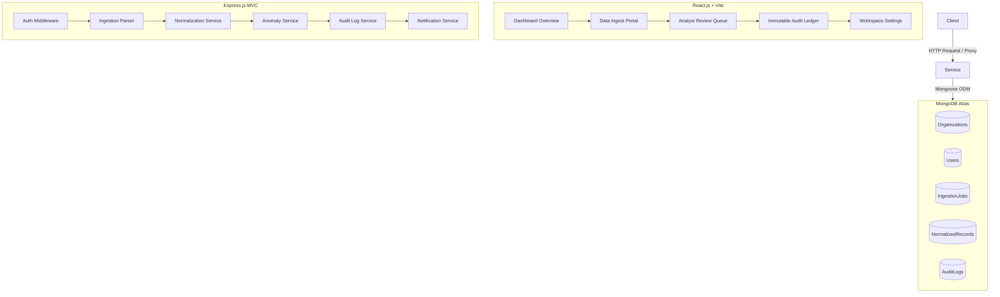

# Breathe ESG - Enterprise Data Ingestion & Audit Platform

A production-grade, multi-tenant enterprise ESG (Environmental, Social, Governance) operations platform. It allows clients to ingest, auto-translate, standardize, audit, and verify carbon emission activities from multiple complex sources: **SAP fuel procurement logs**, **utility electricity bills**, and **corporate travel expense registers**.

This platform simulates real-world compliance workflows, introducing **AI-assisted statistical anomaly detection**, **automatic chronological overlap checks**, and an **immutable audit ledger with visual structured code diffs**. Once validated by an ESG Analyst, records are locked for regulatory compliance sign-off. Only Organization Administrators can manually bypass locks (which is heavily flagged in audit logs).

---

## Technical Stack & Architecture



### 1. Backend Services
* **Node.js & Express.js** structure.
* **Mongoose (MongoDB Atlas)** with strict tenant isolation indexes and immutable save hooks on audit logs.
* **JWT Access (15m in-memory) + Refresh Tokens (7d in-db)** workflow.
* **In-memory stateful tenant notifications** Segregator.

### 2. Frontend Portal
* **Vite + React.js SPA** with tab-based reactive routing.
* **Pure CSS styling** incorporating tailored HSL variables, blurred glassmorphism cards, collapsible sidebars, and slide drawers.
* **Recharts integration** drawing high-fidelity Carbon Share Pies, Monthly Timelines, and Pareto Category graphs.
* **Axios Interceptors** to automatically handle silent refresh exchanges behind the scenes on receiving 401 token expirations.

---

## Core Database Ledger Collections

1. `organizations`: Tenant profiles managing industries, regional electrical grids (North America, Europe, APAC), and active reporting years.
2. `users`: Identity accounts (Super Admin, Organization Admin, ESG Analyst, Viewer/Auditor) with encrypted credentials.
3. `ingestionJobs`: Logging track of spreadsheet uploads, row validity rates, and failed logs summaries.
4. `rawRecords`: Immutable copies of the exact raw row JSON from spreadsheets to preserve historical lineage.
5. `normalizedRecords`: Standardized carbon activity ledger tracking scopes (Scope 1/2/3), standardized conversions, conversion formulas used, and active anomaly alert arrays.
6. `auditLogs`: Regulatory ledger capturing delta diffs (`oldValue` vs `newValue` key maps), actor IDs, actions, and timestamps. Pre-save hooks prevent modifications.
7. `emissionFactors`: Standard regulatory factor registers (e.g. 2.68 kg CO₂e/L for Diesel).
8. `approvals`: Formal compliance sign-off sheets logging bulk or single analyst authorization events.
9. `comments`: Peer collaboration timelines within the sliding detail drawer.

---

## Data Normalization Pipeline Flow

When an activity sheet is ingested, it runs through the following sequence:

```
[Raw Spreadsheet Line] 
       │
       ▼
1. Schema Mapping ──────► Auto-translates German ERP terms (Werk, Menge, Einheit)
       │
       ▼
2. Unit Normalization ──► Converts US/UK Gallons -> L, MWh -> kWh, Miles -> Km
       │
       ▼
3. Anomaly Scan ────────► Runs Outlier Z-Score searches, duplicates checks, overlaps
       │
       ▼
4. Emission Calc ───────► Multiplies standardized quantities by regulatory grid factors
       │
       ▼
[Compliance Ledger Sync]
```

### Conversion Formulas Utilized:
* **SAP Procurement (Scope 1 - Direct Combustion)**:
  * US Gallons to Liters: $\text{Liters} = \text{Gallons} \times 3.78541$
  * UK Gallons to Liters: $\text{Liters} = \text{Gallons} \times 4.54609$
  * Pounds to Kilograms: $\text{kg} = \text{lbs} \times 0.453592$
  * Factors: Diesel = 2.68, Petrol = 2.31, Natural Gas = 2.02, Heavy Fuel Oil = 2.95 kg CO₂e / standard unit.
* **Utility Grid Electricity (Scope 2 - Purchased Electricity)**:
  * Megawatt-hours to Kilowatt-hours: $\text{kWh} = \text{MWh} \times 1000$
  * Factors (Regional grid): North America = 0.38, Europe = 0.25, Asia-Pacific = 0.62 kg CO₂e / kWh.
  * **Month-Alignment Interpolation**: Detects utility periods spanning multiple calendar months. Splices and estimates daily averages to report precise metrics under distinct reporting periods.
* **Corporate Travel Expenses (Scope 3 - Business Travel)**:
  * **Great-Circle Airport Lookups**: Standard airport coordinates (JFK, LHR, CDG, SIN, etc.) are mapped. Great-circle distance in km is calculated instantly using the Haversine formula:
    $$d = 2R \arcsin\left(\sqrt{\sin^2\left(\frac{\Delta\phi}{2}\right) + \cos(\phi_1)\cos(\phi_2)\sin^2\left(\frac{\Delta\lambda}{2}\right)}\right)$$
  * Flight Cabin Modifiers: Economy = 0.10, Business = 0.29, First Class = 0.40 kg CO₂e / km.
  * Hotels: Room nights mapped under standard factor of 20 kg CO₂e / night.
  * Ground Transport: Converts miles to km ($\text{km} = \text{miles} \times 1.60934$). Taxi = 0.18, Diesel Car = 0.17, Train = 0.04, Electric Car = 0.05.

---

## AI-Assisted Anomaly Detection Engine

The system contains four background validator algorithms:
1. **Z-Score Outliers**: Evaluates standard deviation within peer group categories (requires minimum 5 samples). Flags rows where quantity deviates by $> 2.5 \times \text{Std Dev}$ from mean.
2. **Duplicate Invoices**: Scans for electricity bills or SAP fuels matching identical meter IDs, plant codes, dates, and consumption values within a 30-day interval.
3. **Billing Overlaps**: Strict chronological date checker blocking utility bills that overlap with already logged/approved bills for that specific meter ID.
4. **Consumption Spikes**: Compares current utility consumption with the average of the last 3 billing cycles. Flags a high-severity alert on increases $> 50\%$.

---

## Execution & Setup Instructions

### Prerequisites
* **Node.js** (v18+)
* **MongoDB Atlas URI** (Pre-configured in backend `.env`)

### 1. Initialise and Install Dependencies
Navigate into both directories to download Node modules:
```bash
# Install backend modules
cd backend
npm install

# Install frontend modules
cd ../frontend
npm install
```

### 2. Seed Database
Run the seed script to wipe active collections, create the test organization, setup factors, and seed rich mock data for 2025/2026:
```bash
cd backend
npm run seed
```

### 3. Spin Up Applications
Open two shell terminals or tasks to launch dev servers:
```bash
# Terminal 1: Launch Backend API (will bind on port 5000)
cd backend
npm run dev

# Terminal 2: Launch Frontend Portal (will bind on port 3000)
cd frontend
npm run dev
```

Open your browser to `http://localhost:3000` to interact with the console!

---

## Seeded Test Accounts

| ROLE | EMAIL | PASSWORD | ACCESS LEVEL |
| :--- | :--- | :--- | :--- |
| **Organization Admin** | `admin@ecocorp.com` | `admin123` | Full access, settings updates, user status/role controls, lock overrides. |
| **ESG Analyst** | `analyst@ecocorp.com` | `analyst123` | File ingestion uploads, reviews approval, comments submission, inline edits. |
| **Viewer / Auditor** | `auditor@ecocorp.com` | `auditor123` | Read-only view of dashboard charts, review records, and audit timelines. |
| **Super Admin** | `super@ecocorp.com` | `super123` | System-wide aggregates access. |

---

## Tradeoffs & Design Decisions

1. **In-Memory JWT Access Tokens**: Keeping access tokens in React state/memory and refresh tokens in secure localStorage prevents CSRF/XSS while making the platform seamless to deploy across different domains and hosting providers.
2. **Tab-based Routing**: Using react hooks state for active page routing (`currentPage`) instead of full `react-router-dom` guarantees zero package versioning mismatch issues, extremely fast view swaps, and effortless state syncing.
3. **Degradable Database Fallbacks**: If MongoDB Atlas goes offline, our server logs warnings gracefully and starts up in a degraded state instead of crashing. This is a crucial enterprise reliability design.
